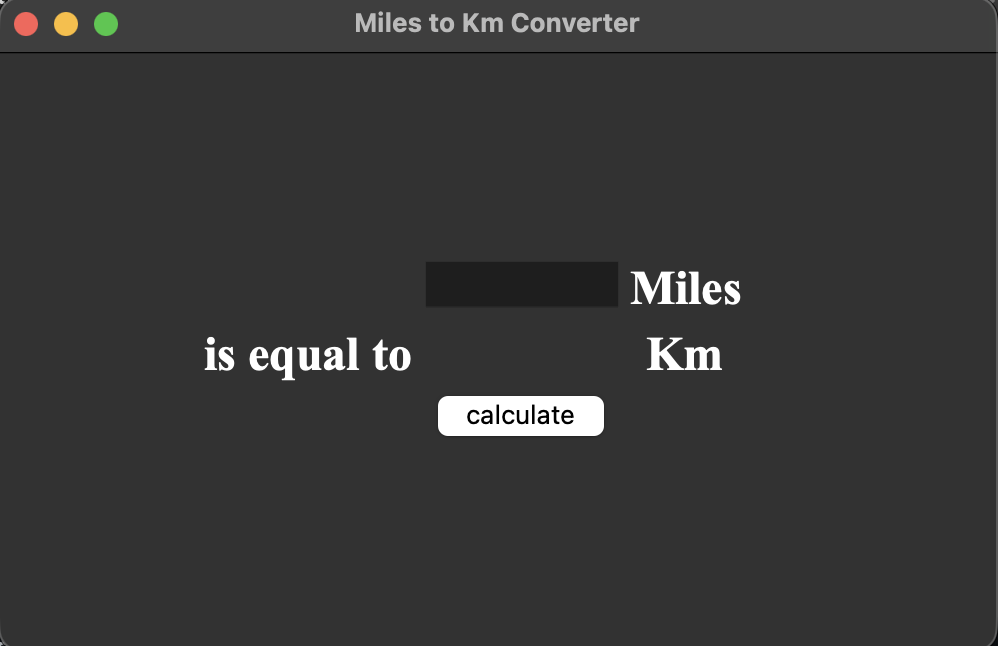

# Miles to Kilometers Converter
A simple GUI application built with Python and Tkinter. 

This program takes an input value in miles, converts it to kilometers, and displays the result on the screen.

### Technologies Used
* Python 3
* Tkinter (Standard GUI Library)

### How to Run
1. Ensure Python is installed on your system.
2. Clone this repository.
3. Run the script from your terminal:
   `python main.py`
